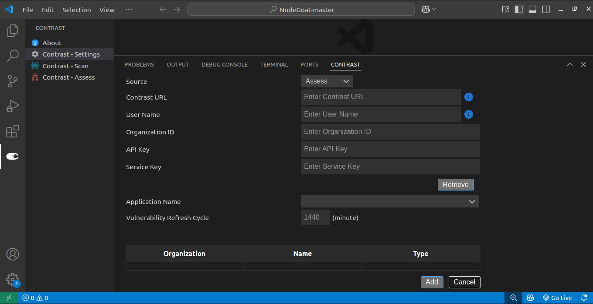
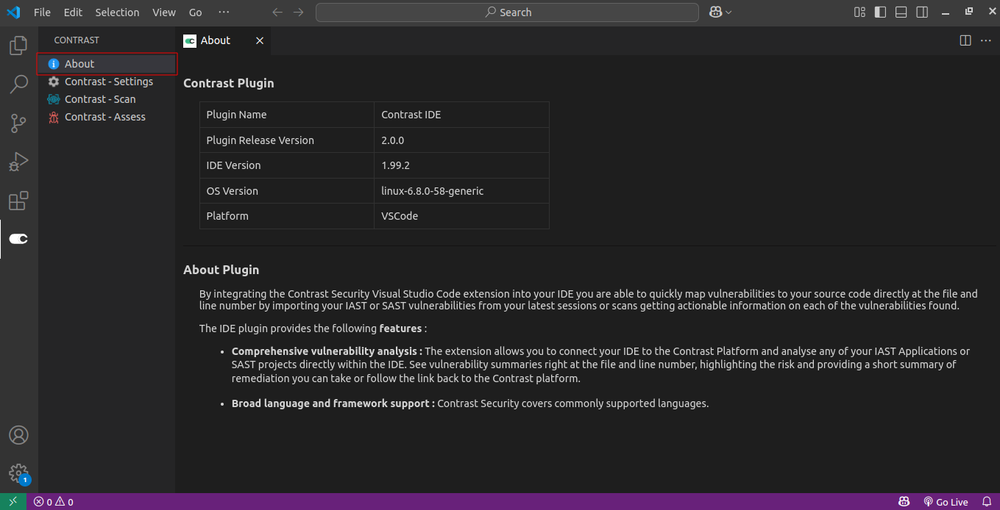
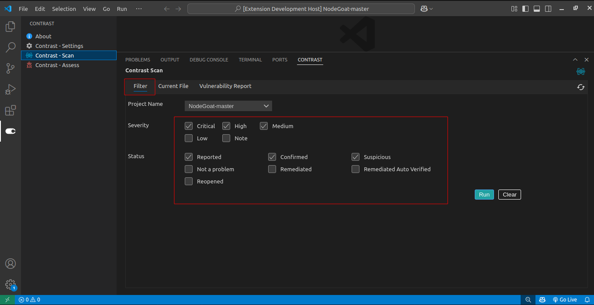
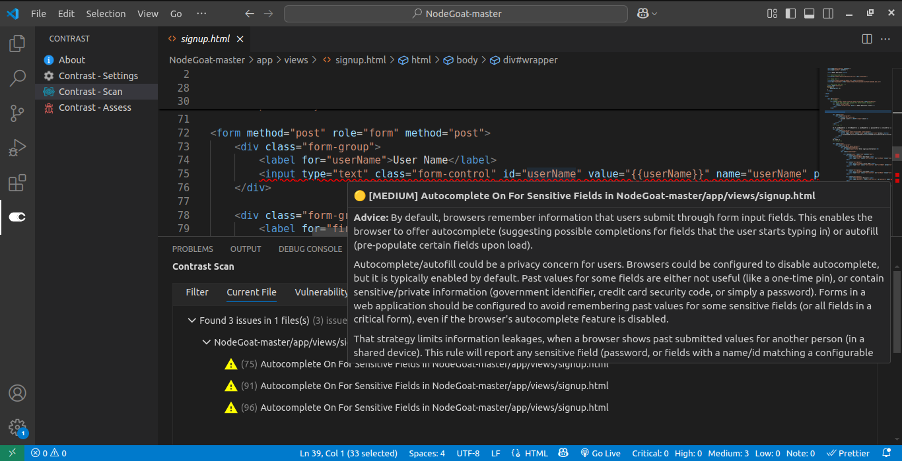
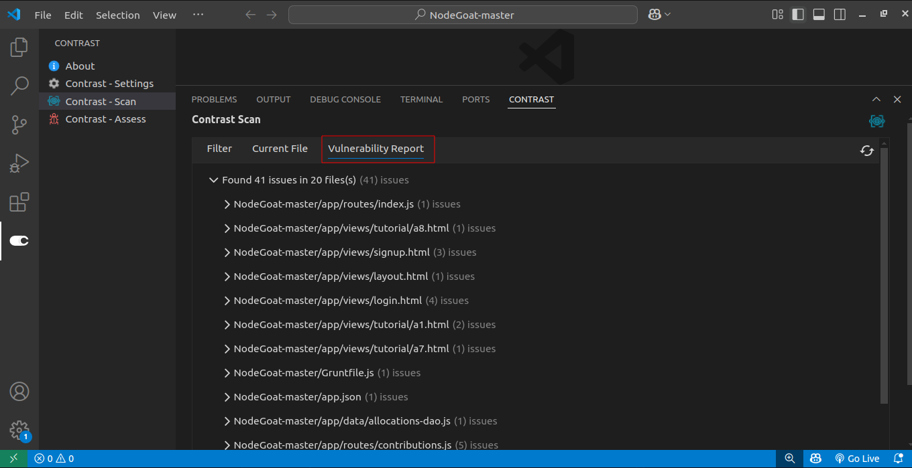
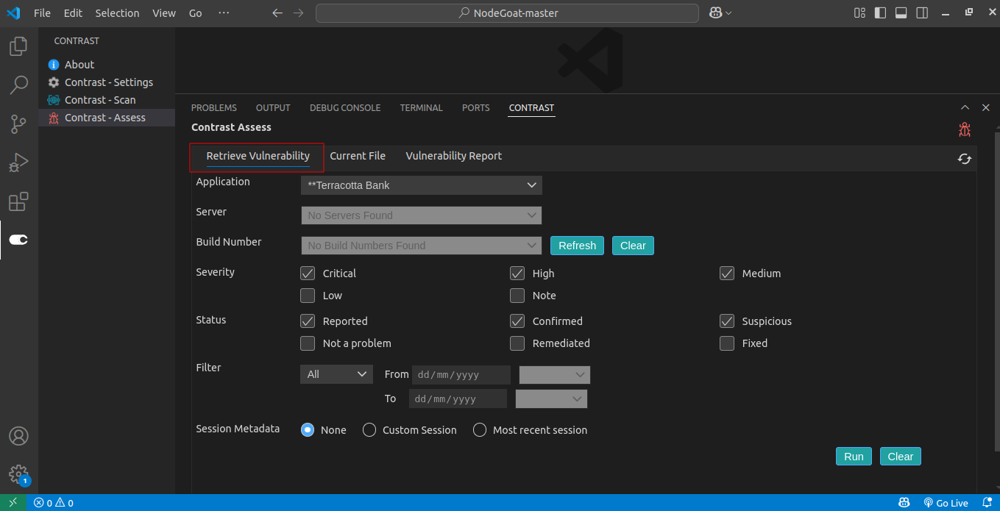
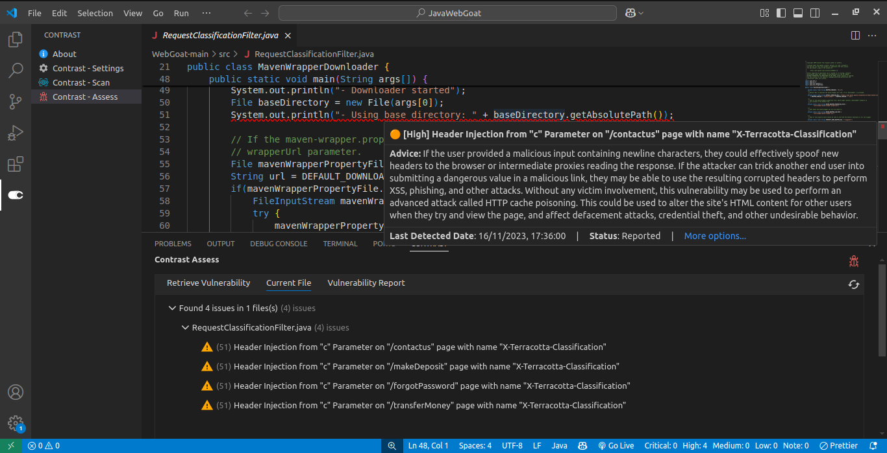
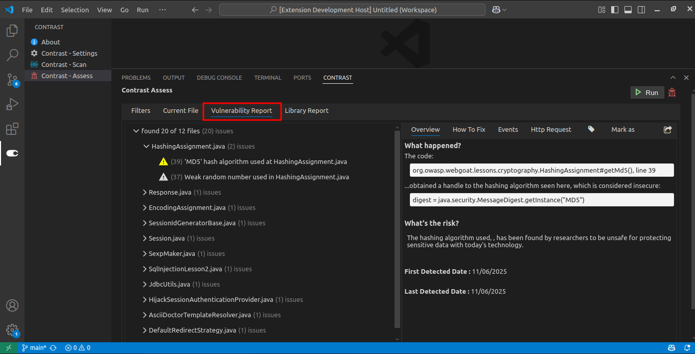

# Contrast IDE Plugin Overview

By integrating the Contrast Security Visual Studio Code extension into your IDE you are able to quickly map vulnerabilities to your source code directly at the file and line number by importing your IAST or SAST vulnerabilities from the latest sessions or scans getting actionable information on each of the vulnerabilities found.

---

### ✨ The IDE plugin provides the following **`features`**:

- **Comprehensive vulnerability analysis**  
  The extension allows you to connect your IDE to the Contrast Platform and analyse any of your IAST Applications or SAST projects directly within the IDE. See vulnerability summaries right at the file and line number, highlighting the risk and providing a short summary of remediation you can take or follow the link back to the Contrast platform.

- ** Broad language and framework support**  
  Contrast Security covers commonly supported languages.

---

### Build and Package the Plugin

#### Steps to build and package the Contrast VSCode Plugin:

- Clone the VS Code plugin repository
- Open the cloned project directory in VSCode
- Install dependencies using npm in the terminal by running `npm install`
- Build the Project by running `npm run build` in the terminal
- Package the plugin using vsce (Visual Studio Code Extension Manager). If not installed, first install vsce by running the command `npm install -g @vscode/vsce`
- Run the build command `vsce package` to generate the **`.vsix`** file

#### Steps to install plugin via VSCode Marketplace:

- Open VS Code.
- Go to the Extensions view **`(Ctrl+Shift+X)`**.
- Search for Contrast and Click on it to view more details.
- Now Click on the install button on the extension’s page.
- Restart the VSCode if required after installing the Contrast extension. (Optional)

#### Steps to manually Install the VS Code Plugin:

- Launch Visual Studio Code on your system.
- Go to the Extensions view **`(Ctrl+Shift+X)`**.
- Click the ellipsis **`(⋮)`** in the top-right corner and select Install from **`VSIX…`**
- Navigate to the location of the **`.vsix`** file and select it.

---

### Contrast IDE Plugin Features

#### 1. Configuration Setting Screen

#### 2. About Page

#### 3. Scan

#### 3.1 Filter

#### 3.2 Current File

#### 3.3 Vulnerability Report

#### 4. Assess

#### 4.1 Retrieve Vulnerability

#### 4.2 Current File

#### 4.3 Vulnerability Report

---

### Frequently Asked Questions

| **Issue**                                                                                                | ✅ **Solution**                                                                                                                                                                                                                                                                                                                                                                                                                                                                                                                                                                                                                                                                                                                                                                            |
| -------------------------------------------------------------------------------------------------------- | ------------------------------------------------------------------------------------------------------------------------------------------------------------------------------------------------------------------------------------------------------------------------------------------------------------------------------------------------------------------------------------------------------------------------------------------------------------------------------------------------------------------------------------------------------------------------------------------------------------------------------------------------------------------------------------------------------------------------------------------------------------------------------------------ |
| Vulnerabilities are not mapping to the current file                                                      | - Ensure the **file name** matches exactly - Confirm the **full file path** is correct                                                                                                                                                                                                                                                                                                                                                                                                                                                                                                                                                                                                                                                                                                  |
| Why are vulnerabilities listed under the "Unmapped Vulnerabilities" section in the vulnerability report? | Vulnerabilities appear in the **Unmapped Vulnerabilities** section when essential metadata is missing—specifically:  • **File path** • **Line number**  These details are usually shown in the vulnerability’s **Overview** section.  Make sure you are reviewing the **Beview** and using the **Latest** report. Without this metadata, Contrast cannot map the issue to a specific file and line in your code, so they’re grouped here for visibility.                                                                                                                                                                                                                                                                                                              |
| Why is there an interlock mechanism implemented in the Contrast plugin?                                  | The **interlock mechanism** in the Contrast plugin is designed to maintain data consistency and avoid conflicts when working with vulnerabilities in your IDE.  🔄 **How it works**: - A user can fetch vulnerabilities from **only one source type** at a time (either **Assess** or **Scan**). - If switching source types (e.g., from Assess to Scan), the user is prompted to **clear the existing cache** before fetching vulnerabilities from the new source type.  This ensures that the plugin doesn’t mix data between the two source types, avoiding incorrect mappings or duplicated entries.  🧩 **Flexibility across IDEs**: Users can still work with different source types for different applications across multiple IDEs without restriction. |
