# Contrast IDE Plugin Overview

By integrating the Contrast extension into your IDE (VSCode or GitPod Web IDE), you are able to quickly map vulnerabilities to your source code directly at the file and line number by importing your ( IAST & SCA ) or SAST vulnerabilities from the latest sessions or scans getting actionable information on each of the vulnerabilities found.

---

### ✨ The IDE plugin provides the following **`features`**:

- **Comprehensive vulnerability analysis**  
  The extension allows you to connect your IDE (VSCode or GitPod Web IDE) to the Contrast Platform and analyse any of your IAST Applications or SAST projects directly within the IDE. See vulnerability summaries right at the file and line number, highlighting the risk and providing a short summary of remediation you can take or follow the link back to the Contrast platform.
  IAST vulnerabilities are fetched along with SCA library vulnerabilities.

- **Broad language and framework support**  
  Contrast Security covers commonly supported languages.

---

### Build and Package the Plugin

#### Steps to build and package the Contrast VSCode Plugin:

- Clone the VS Code plugin repository
- Open the cloned project directory in VSCode
- Install dependencies using npm in the terminal by running `npm install`
- Build the Project by running `npm run build` in the terminal
- Package the plugin using vsce (Visual Studio Code Extension Manager). If not installed, first install vsce by running the command `npm install -g @vscode/vsce`
- Run the build command `vsce package` to generate the **`.vsix`** file

#### Steps to install plugin via VSCode Marketplace (VSCode IDE):

- Open VS Code.
- Go to the Extensions view **`(Ctrl+Shift+X)`**.
- Search for Contrast IDE and Click on it to view more details.
- Now Click on the install button on the extension’s page.
- Restart the VSCode if required after installing the Contrast extension. (Optional)

#### Steps to manually Install the plugin (VSCode IDE):

- Launch Visual Studio Code on your system.
- Go to the Extensions view **`(Ctrl+Shift+X)`**.
- Click the ellipsis **`(⋮)`** in the top-right corner and select Install from **`VSIX…`**
- Navigate to the location of the **`.vsix`** file and select it.

#### Steps to Install plugin via Open VSX registry marketplace (Gitpod Web IDE):

- Launch Ona (Gitpod) in your browser.
- Create a workspace/project and open it in the VS Code browser.
- Go to the Extensions view **`(Ctrl+Shift+X)`**.
- Search for Contrast IDE and Click on it to view more details.
- Now Click on the install button on the extension’s page.

#### Steps to manually Install the Plugin (Gitpod Web IDE):

- Launch Ona (Gitpod) in your browser.
- Create a workspace/project and open it in the VS Code browser.
- Now go to the Extensions view **`(Ctrl+Shift+X)`**.
- Click the ellipsis **`(⋮)`** in the top-right corner and select Install from **`VSIX…`**
- Navigate to the location of the **`.vsix`** file and select it.

---

### Contrast IDE Plugin Features

#### 1. Configuration Setting Screen

#### 1.1 VSCode IDE

#### 1.2 GitPod Web IDE

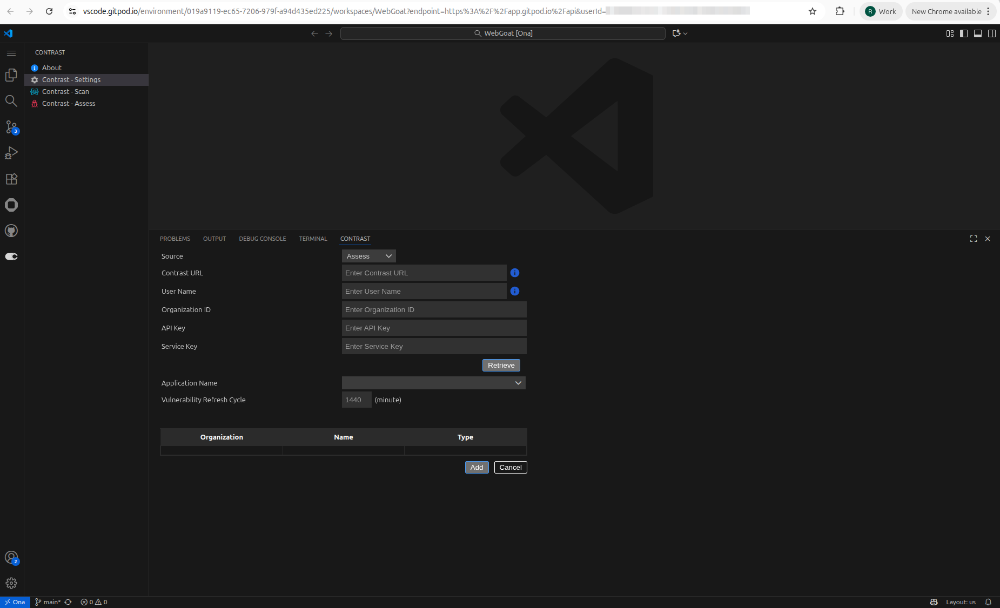

#### 2. About Page

#### 2.1 VSCode IDE

#### 2.2 GitPod Web IDE

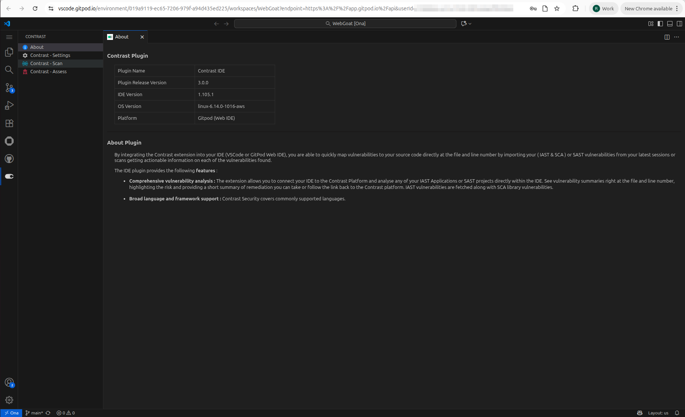

#### 3. Scan

#### 3.1 Filter

#### 3.1.1 VSCode IDE

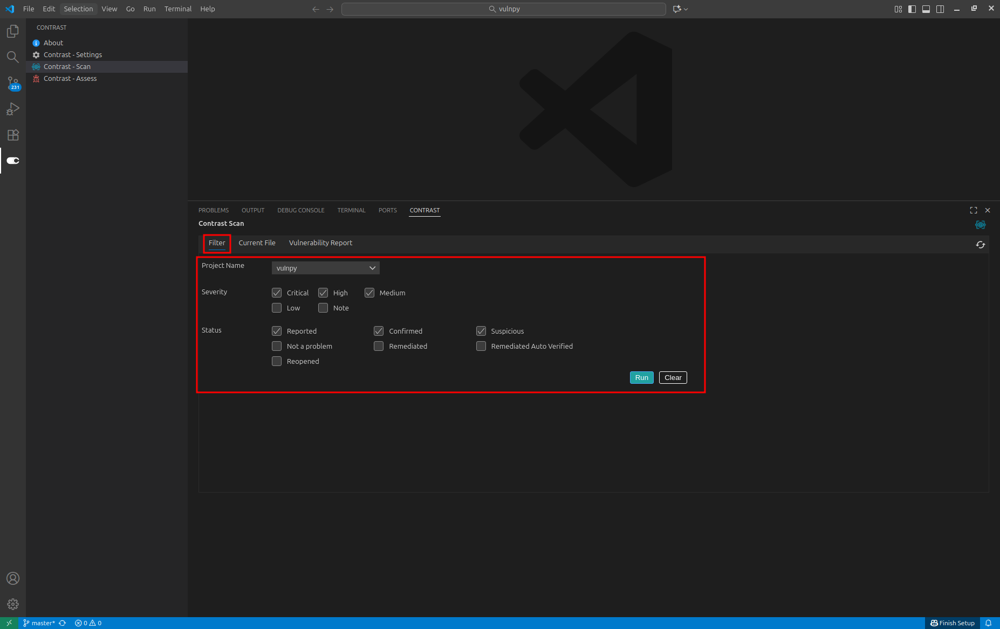

#### 3.1.2 GitPod Web IDE

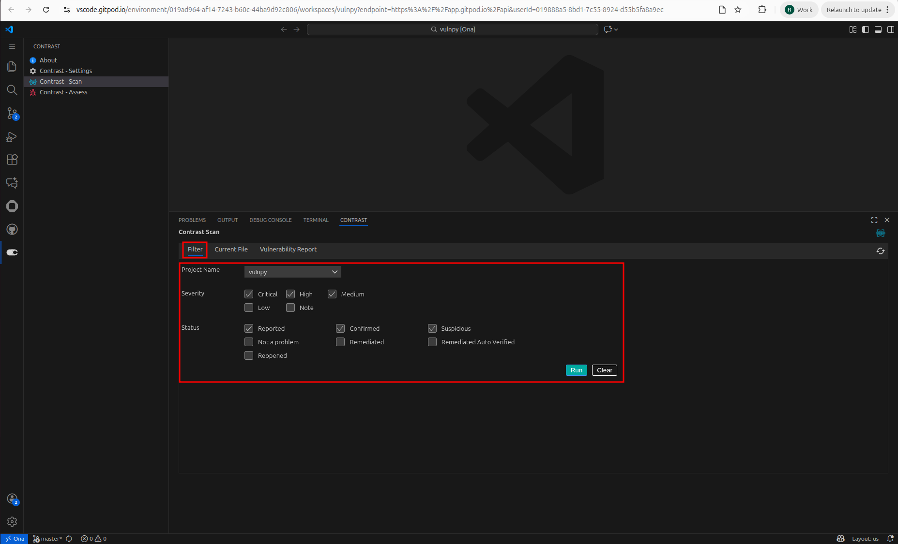

#### 3.2 Current File

#### 3.2.1 VSCode IDE

#### 3.2.2 GitPod Web IDE

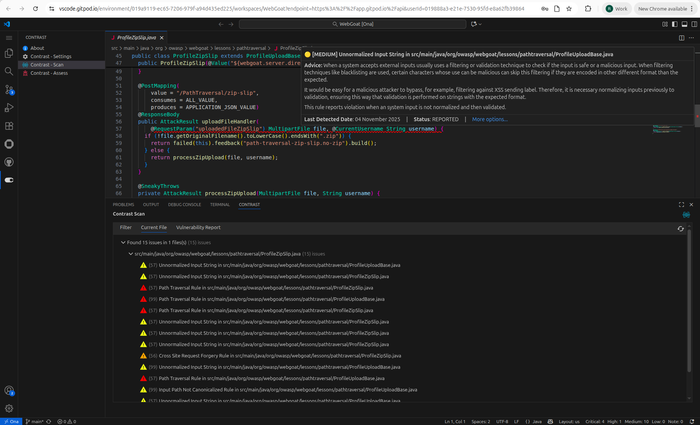

#### 3.3 Vulnerability Report

#### 3.3.1 VSCode IDE

#### 3.3.2 GitPod Web IDE

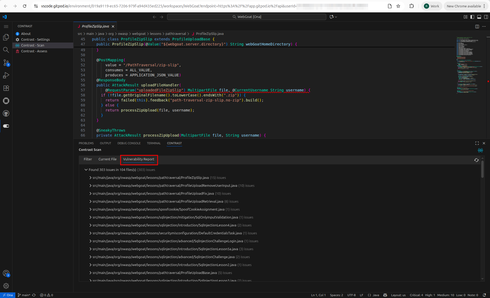

#### 4. Assess

#### 4.1 Vulnerability Filter

#### 4.1.1 VSCode IDE

#### 4.1.2 GitPod Web IDE

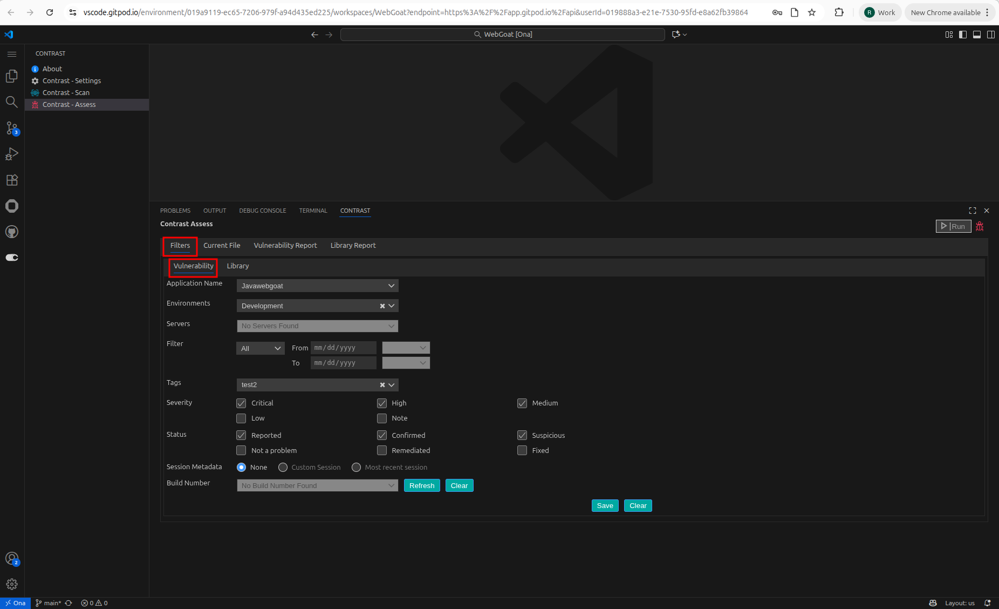

#### 4.2 Library Filter

#### 4.2.1 VSCode IDE

#### 4.2.2 GitPod Web IDE

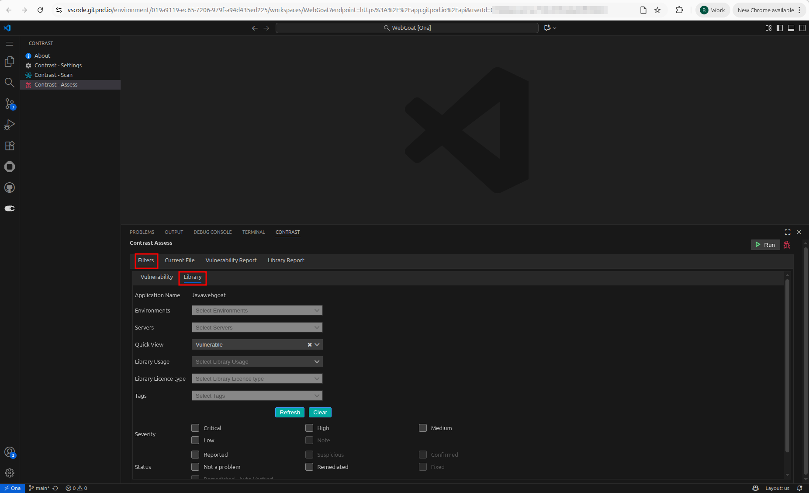

#### 4.3 Current File

#### 4.3.1 VSCode IDE

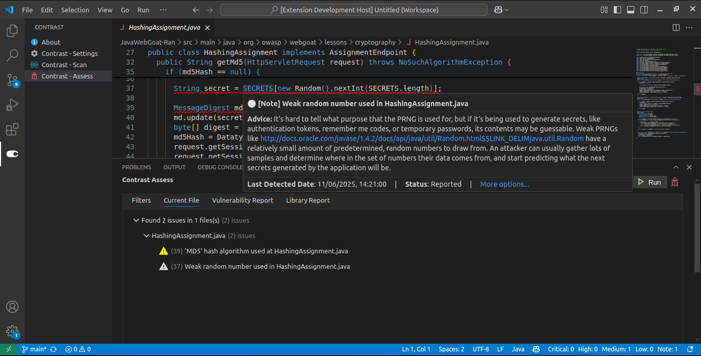

#### 4.3.2 GitPod Web IDE

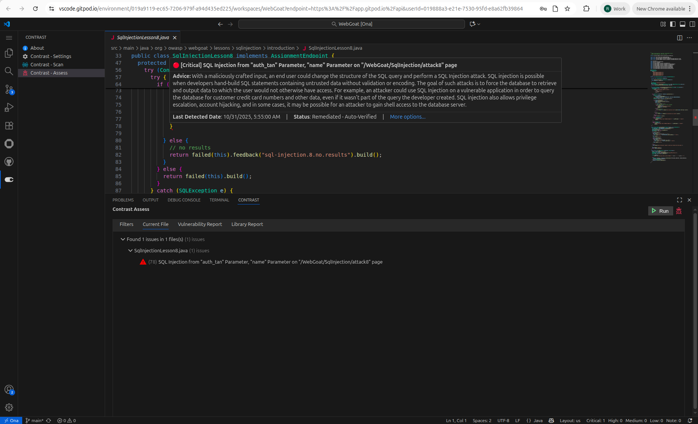

#### 4.4 Vulnerability Report

#### 4.4.1 VSCode IDE

#### 4.4.2 GitPod Web IDE

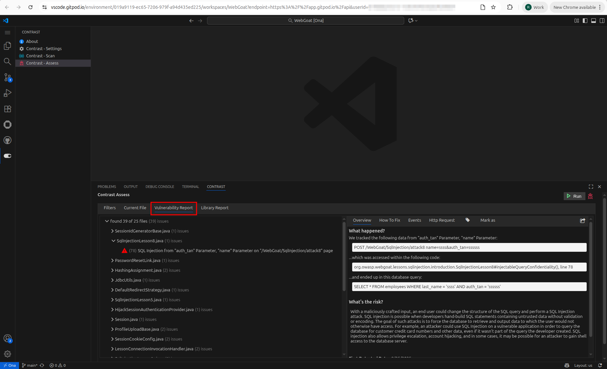

#### 4.5 Library Report

#### 4.5.1 VSCode IDE

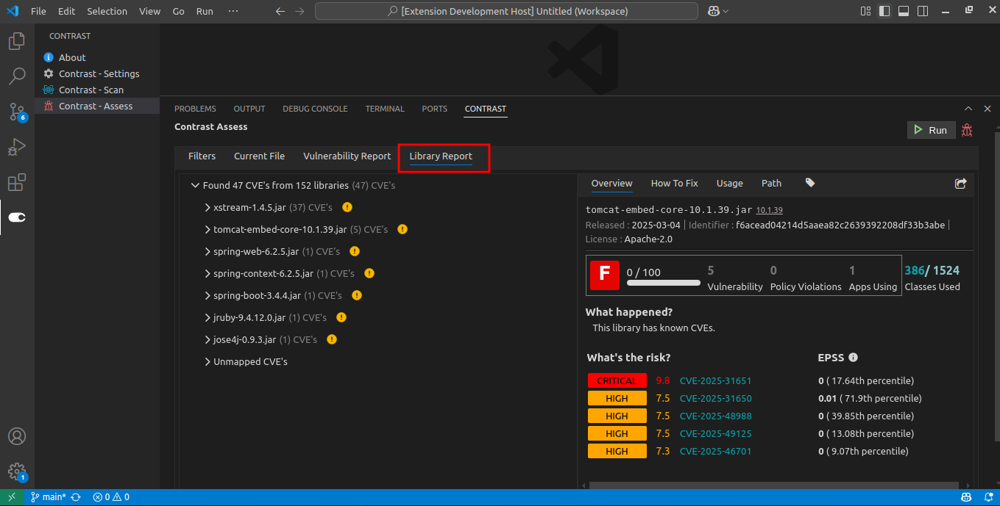

#### 4.5.2 GitPod Web IDE

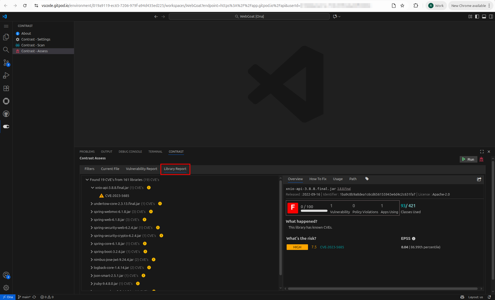

---
### Note : Change the version manually only if any major release - https://github.com/Contrast-Security-OSS/contrast-vscode-plugin/blob/main/package.json#L5

### Frequently Asked Questions

| **Issue**                                                                                                            | ✅ **Solution**                                                                                                                                                                                                                                                                                                                                                                                                                                                                                                                                                                                                                                                                                                                                                                            |
| -------------------------------------------------------------------------------------------------------------------- | ------------------------------------------------------------------------------------------------------------------------------------------------------------------------------------------------------------------------------------------------------------------------------------------------------------------------------------------------------------------------------------------------------------------------------------------------------------------------------------------------------------------------------------------------------------------------------------------------------------------------------------------------------------------------------------------------------------------------------------------------------------------------------------------ |
| Vulnerabilities are not mapping to the current file                                                                  | - Ensure the **file name** matches exactly - Confirm the **full file path** is correct                                                                                                                                                                                                                                                                                                                                                                                                                                                                                                                                                                                                                                                                                                  |
| Why are vulnerabilities listed under the "Unmapped Vulnerabilities" section in the vulnerability report?             | Vulnerabilities appear in the **Unmapped Vulnerabilities** section when essential metadata is missing—specifically:  • **File path** • **Line number**  These details are usually shown in the vulnerability’s **Overview** section.  Make sure you are reviewing the **Beview** and using the **Latest** report. Without this metadata, Contrast cannot map the issue to a specific file and line in your code, so they’re grouped here for visibility.                                                                                                                                                                                                                                                                                                              |
| Why is there an interlock mechanism implemented in the Contrast plugin?                                              | The **interlock mechanism** in the Contrast plugin is designed to maintain data consistency and avoid conflicts when working with vulnerabilities in your IDE.  🔄 **How it works**: - A user can fetch vulnerabilities from **only one source type** at a time (either **Assess** or **Scan**). - If switching source types (e.g., from Assess to Scan), the user is prompted to **clear the existing cache** before fetching vulnerabilities from the new source type.  This ensures that the plugin doesn’t mix data between the two source types, avoiding incorrect mappings or duplicated entries.  🧩 **Flexibility across IDEs**: Users can still work with different source types for different applications across multiple IDEs without restriction. |
| Why does the Path tab sometimes show a "No Path Found" message under the Library Report?                             | The **"No Path Found"** message appears when the specific library is **not detected in any manifest file**.   **Expected Behavior**: - If the library exists in one or more manifest files, the **path(s)** will be listed. - If not, the plugin displays "No Path Found" in the **Path** tab under the Library Report.                                                                                                                                                                                                                                                                                                                                                                                                                                                        |
| Why do policy violation icons appear after library vulnerabilities in the Tree View (Library Vulnerability section)? | The **policy violation icons** indicate libraries that violate organizational rules and are shown after library vulnerabilities for additional context.   **Icon Types**: 1. 🔴 **Restricted Licenses (Red Icon)** – _"Organization prohibits use of this license."_ 2. 🟠 **Restricted Library (Orange Icon)** – _"This is a restricted library and is flagged as a library policy violation."_ 3. 🟡 **Outdated Library (Yellow Icon)** – _"Your organization has set rules on allowed library versions to keep applications compatible and secure. Please update and use the latest library available."_                                                                                                                                                                 |
| Why do some libraries appear under Unmapped CVEs in the Library Report?                                              | - Libraries appear under **Unmapped CVEs** -when they **do not have any associated CVEs**.  - These libraries are listed separately because no known CVEs have been mapped to them                                                                                                                                                                                                                                                                                                                                                                                                                                                                                                                                                                                                      |
